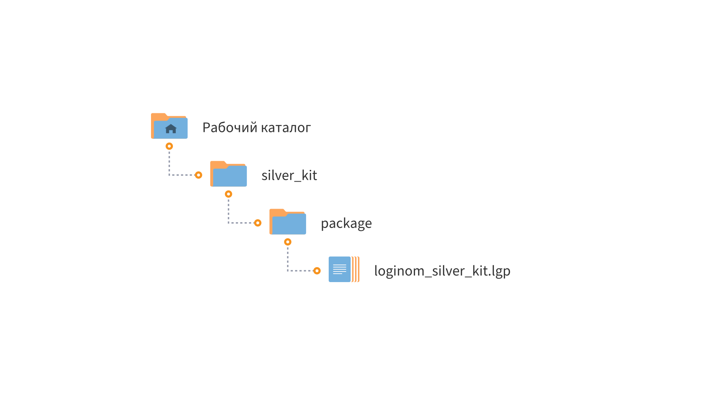

# Loginom Silver Kit

* Версия: 3.1.0
* Проверено: Все редакции Loginom 7.1.0

Библиотека **Loginom Silver Kit** поддерживается и развивается **Loginom Company**. В ней представлены простые и полезные компоненты, облегчающие рутинный труд аналитика по разработке сценариев обработки данных. Компоненты библиотеки широко используются в электронных учебных курсах  компании и библиотеках компонентов к бизнес-курсам.

## Установка

1. Определите рабочий каталог, где будут расположены ваши библиотеки:

   * Для серверных редакций — в рабочем каталоге Loginom Server (в папке пользователя или в общей папке пользователей);
   * Для настольных редакций — в любой папке на локальном диске.

2. Создайте в нем подкаталог **libs**.

3. Разместите папку **silver_kit** в каталоге **libs**.

4. Добавьте ссылку на пакет **loginom_silver_kit.lgp** в своем пакете и используйте компоненты библиотеки.

## Требования

Для работы библиотеки **Loginom Silver Kit** необходимо:

* Установленное ПО Loginom. Версия не ниже 7.1.0

## Список компонентов

### ETL и подготовка данных

* [ABC-анализ](./docs/abc-analysis.md)
* [ABC-анализ (метод касательных)](./docs/abc-analysis-method-of-tangents.md)
* [XYZ-анализ](./docs/xyz-analysis.md)
* [Выделение периода](./docs/period-selection.md)
* [Заполнение периодов](./docs/filling-in-periods.md)
* [Редкие значения](./docs/rare-values.md)
* [Разбиение на пачки](./docs/fragmentation.md)
* [Разделитель строк](./docs/cell-splitter.md)
* [Разделитель строк (переменные)](./docs/cell-splitter-variables.md)
* [Разметка событий](./docs/event-labeling.md)
* [Сэмплинг объектов](./docs/objects-sampling.md)
* [Популярные объекты](./docs/popular-objects.md)

### Data Mining

* [AUC](./docs/auc.md)
* [ROC-анализ](./docs/roc.md)
* [Динамика события](./docs/dynamics-of-events.md)
* [Кластерные силуэты](./docs/cluster-silhouettes.md)
* [Сравнение кластеризаций](./docs/comparison-of-clustering.md)
* [Сравнение метрик](./docs/comparison-of-metrics.md)
* [Статистическая значимость](./docs/statistical-significance.md)
* [Метрики классификации](./docs/classification-metrics.md)
* [Тривиальная модель](./docs/trivial-model.md)
* [IV-отбор](./docs/iv-sampler.md)

### Утилиты

* [Генератор календаря](./docs/calendar-generator.md)
* [Генератор пустых полей](./docs/empty-fields-generator.md)
* [Генератор списка](./docs/list-generator.md)
* [Категория к числу](./docs/category-to-number.md)
* [Разность дат](./docs/dates-difference.md)
* [Сдвиг дат](./docs/dates-shift.md)
* [Перцентиль N%](./docs/percentile-n.md)
* [Случайная категория JS](./docs/random-category.md)
* [Фильтр столбцов JS](./docs/column-filter.md)
* [IF-объединение JS](./docs/if-union.md)
* [Список полей JS](./docs/columns-list.md)
* [JSON-парсер JS](./docs/parse-json.md)
* [Объединение столбцов JS](./docs/column-union.md)