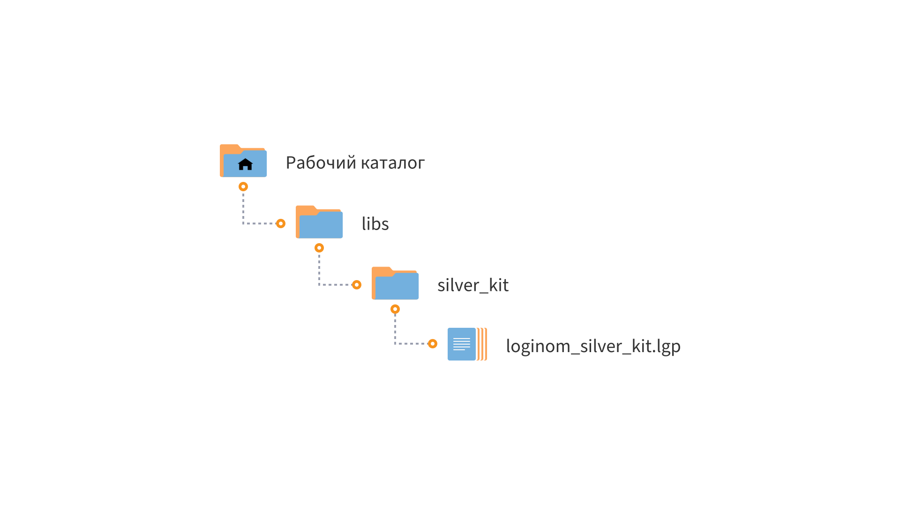

# Loginom Silver Kit

* Версия: 3.1.2
* Проверено: Все редакции Loginom 7.1.5

Библиотека **Loginom Silver Kit** поддерживается и развивается **Loginom Company**. В ней представлены простые и полезные компоненты, облегчающие рутинный труд аналитика по разработке сценариев обработки данных. Компоненты библиотеки широко используются в электронных учебных курсах  компании и библиотеках компонентов к бизнес-курсам.

## Установка

1. Определите рабочий каталог, где будут расположены ваши библиотеки:

   * Для серверных редакций — в рабочем каталоге Loginom Server (в папке пользователя или в общей папке пользователей);
   * Для настольных редакций — в любой папке на локальном диске.

2. Создайте в нем подкаталог **libs**.

3. Разместите папку **silver_kit** в каталоге **libs**.

4. Добавьте ссылку на пакет **loginom_silver_kit.lgp** в своем пакете и используйте компоненты библиотеки.

## Требования

Для работы библиотеки **Loginom Silver Kit** необходимо:

* Установленное ПО Loginom. Версия не ниже 7.1.5