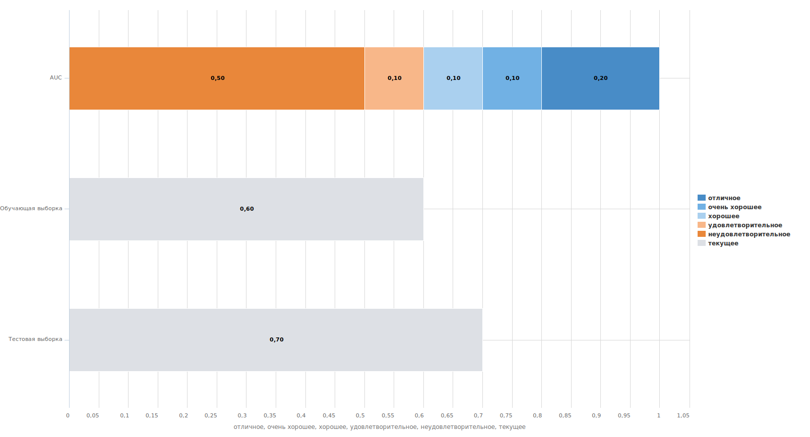

# Сравнение метрик

[Назад к списку компонентов](../README.md)

## Назначение

Компонент для сравнения текущих показателей с эталонной шкалой AUC, Gini, KS, Индекс силуэта (на выбор) и с построением визуализации.

## Входные порты

| Название      | Тип        |
|:--------------|:-----------|
| Метрика 1     | Переменные |
| Метрика 2     | Переменные |
| Метрика 3     | Переменные |
| Тип метрик    | Переменные |

### Переменные в порте "Метрика 1"

| № | Метка              | Тип                                     | Значение           |
|:--|:-------------------|:----------------------------------------|:-------------------|
| 1 | Метрика 1.Метка    |  Строковый         | Обучающая выборка  |
| 2 | Метрика 1.Значение |  Вещественный  | 0,6                |

### Переменные в порте "Метрика 2"

| № | Метка              | Тип                                     | Значение           |
|:--|:-------------------|:----------------------------------------|:-------------------|
| 1 | Метрика 2.Метка    |  Строковый         | Тестовая выборка   |
| 2 | Метрика 2.Значение |  Вещественный  | 0,7                |

### Переменные в порте "Метрика 3"

| № | Метка              | Тип                                     | Значение           |
|:--|:-------------------|:----------------------------------------|:-------------------|
| 1 | Метрика 3.Метка    |  Строковый         | null               |
| 2 | Метрика 3.Значение |  Вещественный  | null               |

### Переменные в порте "Тип метрик"

| № | Метка         | Тип                                     | Значение    |
|:--|:--------------|:----------------------------------------|:------------|
| 1 | Тип метрики   |  Строковый         | AUC         |

**Тип метрики** — позволяет выбрать тип шкалы для сравнения метрик. Возможные значения:

    * **AUC** — индекс AUC (по умолчанию);
    * **Gini** — индекс Gini;
    * **KS** — статистика KS;
    * **SI** — индекс силуэта.

### Выходные порты

| Название          | Тип        |
|:------------------|:-----------|
| Сравнение метрик  | Таблица    |

### Структура таблицы "Сравнение метрик"

| Метка                | Тип                                        | Описание                                          |
|:---------------------|:-------------------------------------------|:--------------------------------------------------|
| Тип метрики          |  Строковый            | Название эталонной шкалы и меток текущих метрик   |
| текущее              |  Вещественный     | Значение текущих метрик                           |
| неудовлетворительное |  Вещественный     | Неудовлетворительное значение эталонной шкалы     |
| удовлетворительное   |  Вещественный     | Удовлетворительное значение эталонной шкалы       |
| хорошее              |  Вещественный     | Хорошее значение эталонной шкалы                  |
| очень хорошее        |  Вещественный     | Очень хорошее значение эталонной шкалы            |
| отличное             |  Вещественный     | Отличное значение эталонной шкалы                 |

## Визуализаторы

### Диаграмма "Сравнение метрик"

