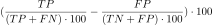
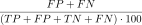
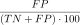
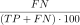
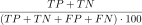

# ROC-анализ

[Назад к списку компонентов](../README.md)

## Назначение

Оценка качества модели оценки вероятности некоторого события и расчет различных метрик, принятых в ROC-анализе:

* расчет чувствительности, специфичности, и других показателей ROC-анализа для каждого значения порога отсечения, заданного с указанной точностью;
* расчет коэффициента KS (статистика Колмогорова-Смирнова);
* выбор порога отсечения с помощью различных методов.

## Входные порты

| Название             | Тип        |
|:---------------------|:-----------|
| Входной набор данных | Таблица    |
| Параметры алгоритма  | Переменные |

### Структура таблицы "Входной набор данных"

| Метка   | Тип                                    | Описание                                                               |
|:--------|:---------------------------------------|:-----------------------------------------------------------------------|
| Событие |  Логический      | **true** — соответствует событию, **false** — соответствует не событию |
| Порог   |  Вещественный | Значение вероятности события                                           |

### Переменные в порте "Параметры алгоритма"

| № | Метка                            | Тип                                    | Значение |
|:--|:---------------------------------|:---------------------------------------|:---------|
| 1 | Точность                         |  Целый           |        4 |
| 2 | Уровень чувствительности         |  Вещественный |       90 |
| 3 | Цена ошибки - ложноположительные |  Вещественный |        1 |
| 4 | Цена ошибки - ложноотрицательные |  Вещественный |        1 |
| 5 | Метод выбора порога отсечения    |  Строковый        |        3 |

1. **Точность** — количество знаков после запятой, до которого требуется округлить пороговое значение.

2. **Уровень чувствительности** — уровень чувтвительности для выбора порога отсечения по выбранному методу.

3. **Цена ошибки - ложноположительные**/**Цена ошибки - ложноотрицательные** — веса ошибок.

4.  **Метод выбора порога отчесения**:

* Заданная чувствительность;
* Чувствительность, равная проценту точности события;
* Максимальное значение KS;
* Минимум издержек ошибок классификации;
* Максимум точности события.

## Выходные порты

| Название              | Тип        |
|:----------------------|:-----------|
| Набор данных          | Таблица    |
| KS, %                 | Переменные |
| Порог отсечения       | Таблица    |

### Структура таблицы "Набор данных"

| Метка                                     | Тип                                    | Описание                                                                                 |
|:------------------------------------------|:---------------------------------------|:-----------------------------------------------------------------------------------------|
| Порог округлённый                         |  Вещественный | Пороговое значение, округленное до заданной точности                                     |
| Истинноположительные случаи               |  Целый           | Количество истинноположительных (TP)                                                     |
| Ложноположительные случаи                 |  Целый           | Количество ложноположительных (FP)                                                       |
| Предсказанные положительные               |  Целый           | TP+FP                                                                                    |
| Истинноотрицательные случаи               |  Целый           | Количество истинноотрицательных (TN)                                                     |
| Ложноотрицательные случаи                 |  Целый           | Количество ложноотрицательных (FN)                                                       |
| Предсказанные отрицательные               |  Целый           | TN+FN                                                                                    |
| Чувствительность, %                       |  Вещественный |                                           |
| Специфичность, %                          |  Вещественный |                                           |
| (Процент событий) - (Процент не-событий)  |  Вещественный | |
| Изменение количества истинноположительных |  Целый           | Разница между текущим и следующим значением TP                                           |
| Изменение количества ложноположительных   |  Целый           | Разница между текущим и следующим значением FP                                           |
| % ошибок                                  |  Вещественный |                                 |
| % ложноположительных                      |  Вещественный |                                          |
| % ложноотрицательных                      |  Вещественный |                                          |
| Издержки классификации                    |  Вещественный | Ошибки, взвешенные через их цену                                                         |
| % точности классификации                  |  Вещественный |                                 |
| % точности события                        |  Вещественный |                                          |
| % точности не-события                     |  Вещественный |                                          |

### Переменные в порте "KS, %"

| № | Метка | Тип                                    | Описание                                  |
|:--|:----- |:---------------------------------------|:------------------------------------------|
| 1 | KS, % |  Вещественный | Значение статистики Колмогорова-Смирнова  |

### Структура таблицы "Порог отсечения"

| Метка                                     | Тип                                    | Описание                 |
|:------------------------------------------|:---------------------------------------|:--------------------------------------|
| Метод выбора порога                       |  Строковый        | Наименование метода                                         |
| Порог округлённый                         |  Вещественный | Выбранное значение порога отсечения, округленное до заданной точности         |
| Истинноположительные случаи               |  Целый           | Количество истинноположительных (TP)                             |
| Ложноположительные случаи                 |  Целый           | Количество ложноположительных (FP)                                    |
| Предсказанные положительные               |  Целый           | TP+FP                                                                 |
| Истинноотрицательные случаи               |  Целый           | Количество истинноотрицательных (TN)                   |
| Ложноотрицательные случаи                 |  Целый           | Количество ложноотрицительных (FN)                      |
| Предсказанные отрицательные               |  Целый           | TN+FN                                                           |
| Чувствительность, %                       |  Вещественный |        |
| Специфичность, %                          |  Вещественный |            |
| (Процент событий) - (Процент не-событий)  |  Вещественный | |
| Изменение количества истинноположительных |  Целый           | Разница между текущим и следующим значением TP          |
| Изменение количества ложноположительных   |  Целый           | Разница между текущим и следующим значением FP               |
| % ошибок                                  |  Вещественный |               |
| % ложноположительных                      |  Вещественный |                |
| % ложноотрицательных                      |  Вещественный |                    |
| Издержки классификации                    |  Вещественный | Ошибки, взвешенные через их цену                                 |
| % точности классификации                  |  Вещественный |               |
| % точности события                         |  Вещественный |                         |
| % точности не-события                      |  Вещественный |                    |

## Алгоритмы

Псевдокоды алгоритма ROC-анализа доступны в статье по [ссылке](http://web.ydu.edu.tw/~alan9956/docu/refer/roc_introduction.pdf).

## Дополнительная литература

1. [ROC-кривая - материал из Wikipedia (рус.)](https://ru.wikipedia.org/wiki/ROC-%D0%BA%D1%80%D0%B8%D0%B2%D0%B0%D1%8F)
2. [ROC-анализ - материал из Wikipedia (англ.)](https://en.wikipedia.org/wiki/Receiver_operating_characteristic)
3. [Bradley, A. The use of the area under the ROC curve in the evaluation of machine learning algorithms](https://www.cse.ust.hk/nevinZhangGroup/readings/yi/Bradley_PR97.pdf) — статья в журнале Pattern Recognition, июль 1997.
